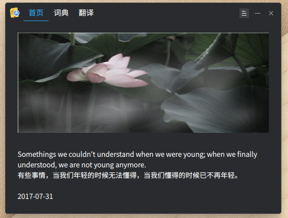
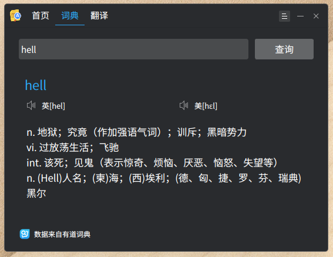

# Rekols词典

基于dtk开发的一款词典

## 编译依赖

`sudo apt install g++ qt5-default libdtkbase-dev libdtkwidget-dev libdtkutil-dev libxcb-util0-dev libxtst-dev`

## 编译

* mkdir build
* cd build
* qmake ..
* make

## 运行

* ./rekols-dict

## License

本词典以GPLv3协议发布，禁止违反GPLv3协议非法闭源.
